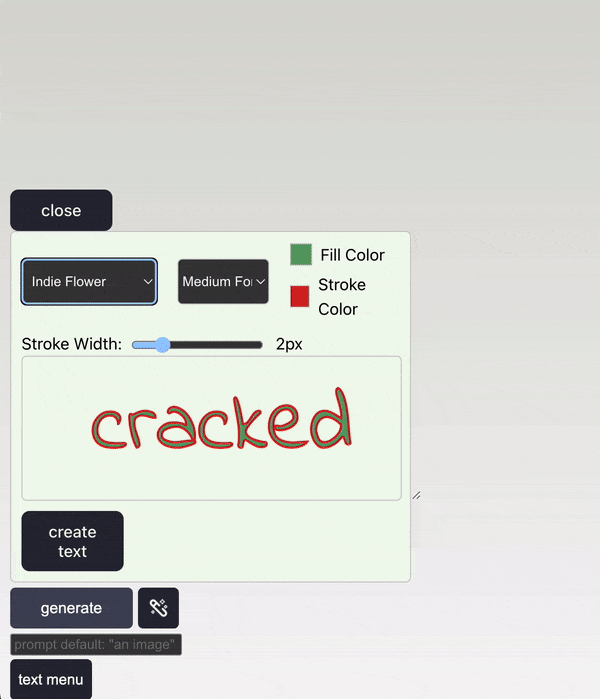

# DingDocs!

## Dingboard, Dingboard, Dingboard! 

### The most cracked, banger of an AI photo-editor/meme-creator on this side of the local supercluster!

## Dingboard presents: **Dingdocs!** 

### First-rate documentation the likes of which Ad*be could only dream of!

## Which way modern man?

 {width = "450"}

## Table of Contents
1. [Adding Images](#adding-images)
2. [Adding Text](#adding-text)
3. [Dingtools](#dingtools)
    1. [Segmentation](#segmentation)
    2. [Depthwise Background Removal](#depthwise-background-removal)
    3. [Mirror item](#mirror-item)
    4. [Magical Fix](#magical-fix)
4. [Moving](#moving)
5. [Saving and Exporting](#saving-and-exporting)

## Adding Images

To add your first image, simply click the "Upload Image" button in the top right corner of Dingboard.

{width = "150"}

To remove an image, click on the image, and use the trash can on the right hand side of the toolbar that pops up.

## Adding Text

In the bottom left, there is a "Text Menu" button. Click this to add text to your image.

{width = "250"}

There is a scaling slider in the text menu that allows you to change the stroke width in relation to the text.

{width = "450"}

There are also options to change the font, font size, and font color:

{width = "450"}

## Dingtools

Dingtools are the tools that allow you to manipulate your images.

### Segmentation

The Segmentation tool allows you to select a portion of your image and move it around.
It uses the amazing AI Segment Anything Model under the hood, so all it takes is a little hovering and clicking to select the required region.

{width = "450"}

### Depthwise Background Removal

The Depthwise Background Removal tool allows you to remove the background from your image via an interactive slider.

{width = "450"}

### Mirror item

The Mirror item tool allows you to mirror your image horizontally.

{width = "450"}

### Magical Fix

Dingboard has a magical fix button that will automatically fix the jankiest bits of your image for you!

{width = "450"}

### Grouping items

To group items, click and drag over the items you want to group, and then click the group objects together button in the toolbar that pops up. 

This will unify the selected objects into a single image, which is crucial if you want to download/export what you've made.

{width = "450"}

## Moving

When dealings with multiple items, Dingboard has a layering system that allows you to move items **backwards only** in the layering order.

This means you need to select the item(s) you want to move backwards in the right order, and then click the "Move Item To Back" button in the toolbar that pops up.

{width = "450"}

## Saving and Exporting

Exporting can be done either via the toolbar on the individual image, or by clicking the "Export" button in the bottom right corner of Dingboard, via the "download scene" button.

{width = "150"}

